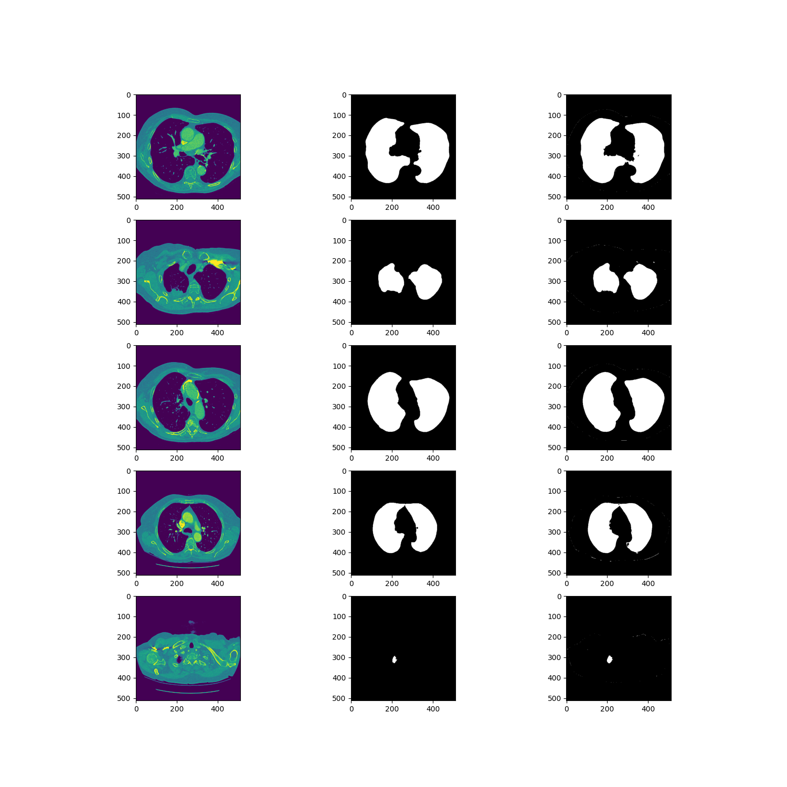

# lung-segmentation
## Основное описание
Данный проект является вариантом решения задачи [Lung Nodule Segmentation on LUNA](https://paperswithcode.com/sota/lung-nodule-segmentation-on-luna).  
[Bi-Directional ConvLSTM U-Net](https://paperswithcode.com/paper/bi-directional-convlstm-u-net-with-densley) на сегодняшний момент является наиболее оптимальным.  
В качестве основы для проекта был взят [BCDU-Net](https://github.com/rezazad68/BCDU-Net).


## Предварительная подготовка
1. Скачать приложение Git Bash
2. Скачать изображения: [3d_images](https://www.kaggle.com/datasets/kmader/finding-lungs-in-ct-data?select=3d_images.zip) (3d изображений достаточно).  
3. Скачав следующий файл: [weight](https://drive.google.com/open?id=1pHOntUOdqd0MSz4cHUOHi2Ssn3KBH-fU).

## Основная установка
1. Скачать проект с GitHub  
*Примечание:* Рекомендуется воспользоваться консолью Git Bash  
```
git clone https://github.com/sDismuss/lung-segmentation.git
```
  
2. В консоли переходим в папку с проектом  
3. Файл weight помещаем в папку input/example
4. В папке input создаём папку 3d_images, куда складываем все архивы с названием "IMG..." и "MASK..." из архива 3d_images
5. Строим из консоли проект  
Заходим в папку с проектом (через команду cd) и выполняем docker команды 
*Примечание:* Убедитесь, что докер запущен  
```
docker build -t lung-seg .
docker run -it --name lung-container lung-seg
```
  
## Основные команды
1. Подготовка изображений  
Следующая команда подготовит изображения  
```
python3 Prepare_data.py
```
  
2. Тренировка модели  
Эту часть можно пропустить, положив файл weight в папку processed_data.
  
При желании можно запустить следующую команду, чтобы положить тот же результат  
```
python3 train_lung.py
```
  
3. Проверка модели
Для получения результатов тренировки модели запустите следующую команду
```
python3 evaluate_perfomance.py
```
  
## Некоторые примечания
Из 4 вариантов 3d_images можно также взять только одну из них. Этого достаточно, чтобы получить оптимальные результаты.  
В качестве проверки было сравнение между 15 и 154 изображениями. Разница в 0.001.

